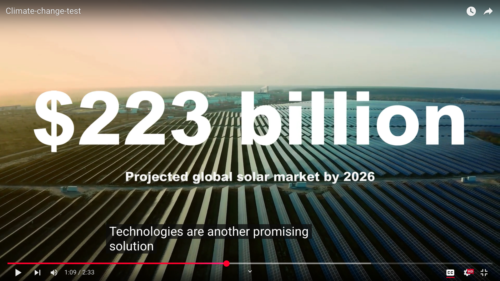

# AI Video Generation Pipeline

An automated content creation pipeline that generates engaging informational videos from a single topic prompt. The system leverages Large Language Models (LLMs) for scriptwriting, scrapes the web for high-quality stock footage, and assembles a final video complete with voiceover and dynamic text overlays.

## Demo


[Video Example](https://www.youtube.com/watch?v=oPaLBVk3fXI)



---

## Core Features

-   **AI-Powered Script Generation**: Takes a simple topic (e.g., "Why is Bitcoin so popular?") and generates a well-structured, detailed video script.
-   **Automated Stock Footage Sourcing**: Intelligently searches, selects, and downloads relevant, high-quality stock video clips from Envato Elements to match the script content.
-   **Text-to-Speech Voiceover**: Generates a clear and natural-sounding voiceover for the script using OpenAI's TTS models.
-   **Dynamic Overlays**: Analyzes the script to identify key statistics, phrases, and concepts, and overlays them as animated text on the final video.
-   **End-to-End Automation**: Streamlines the entire video creation process from a topic idea to a finished, publishable video file.

---

## Workflow

The project follows a sequential pipeline, where the output of one stage becomes the input for the next. The entire process is orchestrated by a series of core Python modules.

### 1. Topic to Script

-   **Module**: `textprocessor.py`
-   **Process**: The user provides a single topic or question. The `TextProcessor` class uses an LLM (via `llmcaller.py`) to flesh this out into a complete video outline. This involves a multi-step process of sketching the initial structure, expanding on each point with facts and examples, and ensuring the narrative is cohesive.
-   **Output**: A structured script object, typically saved as `outline.pkl`.

### 2. Script to Clips

-   **Module**: `clipscraper.py`
-   **Process**:
    1.  The complete script is fed into `ClipScraper`.
    2.  An audio voiceover is generated for the script using OpenAI's TTS, and word-level timestamps are created using Whisper.
    3.  The script is segmented into sentences, and the duration of each sentence is calculated from the timestamps.
    4.  The scraper logs into a stock footage provider (Envato Elements).
    5.  For each sentence, it uses an LLM to determine the best search keyword, scrapes the resulting video clips, and uses the LLM again to select the most visually relevant clip.
    6.  The chosen clips are downloaded and trimmed to match the duration of their corresponding sentences.
-   **Output**: A base video file (`base.mp4`) that contains the concatenated stock clips synchronized with the full audio voiceover.

### 3. Assembling the Final Video

-   **Modules**: `featuredecider.py`, `videoprocessor.py`, `imagecreator.py`
-   **Process**:
    1.  The `featuredecider.py` module analyzes the script and timestamps to identify opportunities for text overlays (e.g., statistics, key phrases, section titles).
    2.  It uses logic from `imagecreator.py` to render these text elements into images.
    3.  Finally, `videoprocessor.py` uses `moviepy` to composite these text overlays onto the `base.mp4` file, creating the final, polished video.
-   **Output**: The final video file (`output.mp4`) with all elements included.

---

## Setup and Installation

1.  **Clone the repository:**
    ```bash
    git clone [https://github.com/your-username/your-repo-name.git](https://github.com/your-username/your-repo-name.git)
    cd your-repo-name
    ```

2.  **Install dependencies:**
    It is recommended to use a virtual environment.
    ```bash
    python -m venv venv
    source venv/bin/activate  # On Windows, use `venv\Scripts\activate`
    pip install -r requirements.txt
    ```
    A `requirements.txt` file should be created with the following key dependencies:
    ```
    openai
    moviepy
    Pillow
    pydantic
    selenium
    webdriver-manager
    configparser
    ```

3.  **Configure the application:**
    Rename `config.conf.example` to `config.conf` and fill in the required values.

---

## Configuration

The `config.conf` file is used to manage API keys, file paths, and other settings.

```ini
[settings]
# API Keys and Credentials
openai_api_key = YOUR_OPENAI_API_KEY
envato_email = YOUR_ENVATO_ELEMENTS_EMAIL
envato_password = YOUR_ENVATO_ELEMENTS_PASSWORD

# File Paths
root = /path/to/your/project/root
download_root = /path/to/your/downloads/folder
# ... other path and model settings
```

---

## Usage

The pipeline is run in stages. While a master script can be created to run all steps, the core logic can be triggered as follows:

1.  **Generate the Script:**
    Modify and run `textprocessor.py` with your desired topic.
    ```python
    # Inside textprocessor.py
    if __name__ == '__main__':
        # ...
        user_message = "Your new video topic here"
        tp = TextProcessor(root, model, output_dir, user_message)
        tp.production()
    ```

2.  **Generate the Video Clips:**
    Run `clipscraper.py`, ensuring it points to the output directory from the previous step.
    ```python
    # Inside clipscraper.py
    if __name__ == '__main__':
        # ...
        output_dir = '/data/your_project_folder'
        # Load script from the TextProcessor output
        with open(f"{root}{output_dir}/script.txt", 'r') as f:
            script = f.read()
        cs = ClipScraper(output_dir, script)
        cs.production()
    ```

3.  **Add Overlays and Finalize:**
    Run `featuredecider.py` to add the final touches to the video generated by `ClipScraper`.
    ```python
    # Inside featuredecider.py
    if __name__ == '__main__':
        # ...
        output_dir = '/data/your_project_folder'
        # Load script and timestamps
        # ...
        o = Overlay(output_dir, script, timestamps)
        o.getStats()
        o.getKeyPhrases()
        # ... and so on to composite the final video
    ```
---

## Key Components

-   **`textprocessor.py`**: The brain of the content creation. Interfaces with LLMs to write the script.
-   **`clipscraper.py`**: The workhorse for visual sourcing. Handles web scraping, video downloading, and initial clip assembly.
-   **`featuredecider.py`**: The creative director for visuals. Decides what text to show and when, adding a layer of polish.
-   **`llmcaller.py`**: A centralized utility for making structured calls to the OpenAI API.
-   **`imagecreator.py`**: A PIL-based utility for generating text images and video thumbnails.
-   **`videoprocessor.py`**: A `moviepy`-based utility for all video manipulation tasks like merging, cropping, and overlaying.
-   **`browser.py`**: A simple Selenium wrapper for browser automation.
-   **`config.conf`**: The central configuration file for all user-specific settings.
